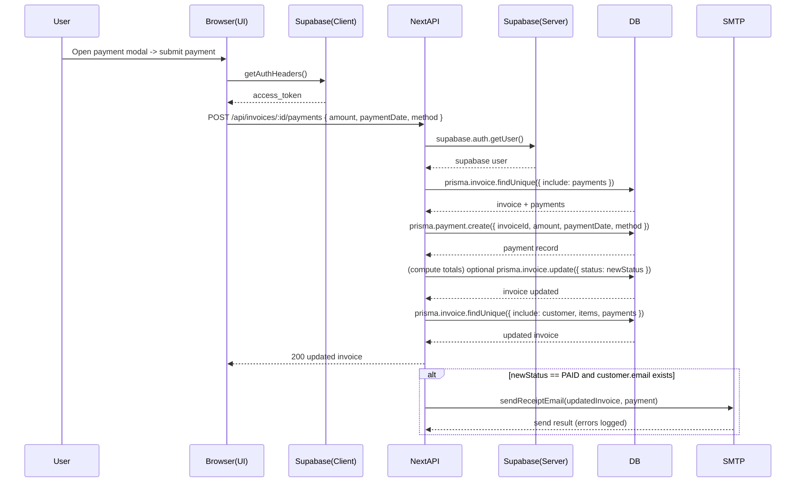
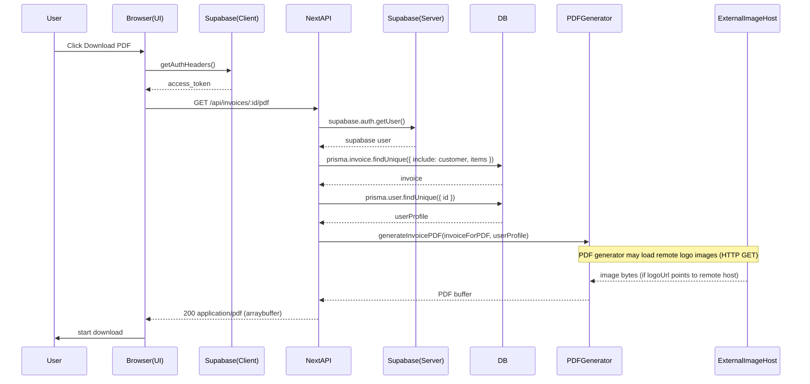

# Invoice flows — Sequence diagrams (Mermaid)

This file contains sequence diagrams for the main invoice flows: Create, Send (email), Delete, Payment, and PDF generation. You can render these Mermaid diagrams in any tool that supports Mermaid (VS Code Mermaid preview, GitHub markdown with mermaid enabled, or convert them to SVG using the Mermaid CLI).

---

## Legend
- User: The human interacting with the UI.
- Frontend: React pages/components (app/... and components/...) that call `getAuthHeaders()` and fetch API routes.
- Supabase Client: Client-side Supabase SDK used by `getAuthHeaders()` to obtain access token.
- API Server: Next.js route handlers under `app/api/...` using `createClient()` server supabase + `prisma`.
- Prisma/DB: Database operations via `prisma.*`.
- PDF Generator: `lib/pdf-generator.ts` (jsPDF + autotable, image loading, canvas usage).
- Email Service: SMTP via Nodemailer (lib/email.getTransporter) or other mail provider.
- Background Worker: Fire-and-forget IIFE in the send route (or a job queue if introduced later).

---

## 1) Create Invoice (POST /api/invoices)

```mermaid
sequenceDiagram
  participant User
  participant Frontend as Browser(UI)
  participant SupabaseClient as Supabase(Client)
  participant API as NextAPI
  participant SupabaseServer as Supabase(Server)
  participant Prisma as DB

  User->>Frontend: Fill invoice form -> click Save
  Frontend->>SupabaseClient: getAuthHeaders() (supabase.auth.getSession)
  SupabaseClient-->>Frontend: access_token
  Frontend->>API: POST /api/invoices (headers + invoice payload)

  API->>SupabaseServer: createClient(); supabase.auth.getUser() (verify token/cookies)
  SupabaseServer-->>API: supabase user
  API->>Prisma: prisma.user.findUnique({id})
  alt DB user exists
    Prisma-->>API: return user
  else no DB user
    API->>Prisma: prisma.user.create(...)
    Prisma-->>API: created user
  end

  API->>Prisma: prisma.invoice.create({ invoice + items })
  Prisma-->>API: created invoice (with items)
  API-->>Frontend: 201 created (serialized invoice)
  Frontend->>User: navigate to invoice detail / show success
```

Notes:
- Client -> API: 1 HTTP request
- Server: 1 Supabase auth check + 1–3 DB ops (user lookup, maybe create, invoice create)

---

## 2) Send Invoice (POST /api/invoices/:id/send)

```mermaid
sequenceDiagram
  participant User
  participant Frontend as Browser(UI)
  participant SupabaseClient as Supabase(Client)
  participant API as NextAPI
  participant SupabaseServer as Supabase(Server)
  participant Prisma as DB
  participant Background as BackgroundWorker
  participant Email as SMTP
  participant PDF as PDFGenerator

  User->>Frontend: Open email modal, click Send
  Frontend->>SupabaseClient: getAuthHeaders()
  SupabaseClient-->>Frontend: access_token
  Frontend->>API: POST /api/invoices/:id/send (recipient, cc, message)

  API->>SupabaseServer: supabase.auth.getUser()
  SupabaseServer-->>API: supabase user
  API->>Prisma: prisma.invoice.findUnique({ include: customer, items })
  Prisma-->>API: invoice data
  API->>Prisma: prisma.user.findUnique({ id })
  Prisma-->>API: user profile

  alt missing recipient
    API-->>Frontend: 400 - No recipient
    return
  end

  API->>Prisma: prisma.invoice.update( set sentTo, lastEmailSentAt, emailCount++, deliveryStatus: 'queued', maybe status->SENT )
  Prisma-->>API: updated invoice
  API-->>Frontend: 200 queued response (fast)

  Note over API,Background: Fire-and-forget background send (IIFE)
  API->>Background: start background task (no await)

  Background->>Prisma: prisma.invoice.findUnique({ include: items, customer, payments })
  Prisma-->>Background: freshInvoice
  Background->>Prisma: prisma.user.findUnique({ id })
  Prisma-->>Background: freshUserProfile
  Background->>PDF: generateInvoicePDF(freshInvoice, freshUserProfile)
  PDF-->>Background: PDF buffer (may load remote logo images)
  Background->>Email: transporter.sendMail({ attachments: [pdf] })
  Email-->>Background: send result
  alt success
    Background->>Prisma: prisma.invoice.update({ deliveryStatus: 'sent', emailDelivered: true })
  else failure
    Background->>Prisma: prisma.invoice.update({ deliveryStatus: 'failed' })
  end

  Background-->>API: (no direct response; logs only)
```

Notes:
- Synchronous response: 1 auth check + invoice read + user read + update (3–4 DB ops) before returning to client.
- Background: additional DB reads, PDF generation, SMTP network I/O, then a DB update.
- Duplicate prevention: server checks `lastEmailSentAt` and prevents repeated sends within 5s.

---

## 3) Delete Invoice (DELETE /api/invoices/:id)

```mermaid
sequenceDiagram
  participant User
  participant Frontend as Browser(UI)
  participant SupabaseClient as Supabase(Client)
  participant API as NextAPI
  participant SupabaseServer as Supabase(Server)
  participant Prisma as DB

  User->>Frontend: Click Delete
  Frontend->>SupabaseClient: getAuthHeaders()
  SupabaseClient-->>Frontend: access_token
  Frontend->>API: DELETE /api/invoices/:id { confirmWithPayments?, removeAssociated?, reason }

  API->>SupabaseServer: supabase.auth.getUser()
  SupabaseServer-->>API: supabase user
  API->>Prisma: prisma.invoice.findFirst({ where: { id, userId, deletedAt:null }, select: { id, status, _count: { payments } } })
  Prisma-->>API: invoice summary

  alt invoice has payments and confirmWithPayments not true
    API-->>Frontend: 400 { requiresConfirmation: true }
    Frontend->>User: show warning & ask confirm
    return
  end

  API->>Prisma: prisma.$transaction([ optional deleteMany(payments), optional deleteMany(items), update invoice set deletedAt, create audit log ])
  Prisma-->>API: transaction result
  API-->>Frontend: 200 success
  Frontend->>User: show deleted message, remove from UI
```

Notes:
- Typical flow: 1 auth check + 1 findFirst read + transaction (1–4 writes)
- Client often does optimistic UI remove then reconciles based on the server response.

---

## 4) Record Payment (POST /api/invoices/:id/payments)



Notes:
- Ensure payment create + status update are robust to concurrency (consider transaction to avoid race conditions).
- Server may send receipt email synchronously or asynchronously (current implementation sends synchronously within route after DB operations; errors are caught and logged).

---

## 5) Generate / Download PDF (GET /api/invoices/:id/pdf)



Notes:
- Server PDF generation uses `lib/pdf-generator.ts` built on jsPDF + autotable and DOM/canvas APIs. If server runtime lacks DOM/canvas, generation may fail — consider using node-canvas or a headless renderer.
- Client-side preview also calls `generateInvoicePDF` (dynamically imported) and runs in-browser using DOM APIs.

---

## How to convert these to SVG
1. Install the Mermaid CLI or use an online Mermaid renderer.
2. Save the desired Mermaid block to a file (e.g., `create.md` with ```mermaid ... ```).
3. Use the CLI to export to SVG:

```powershell
# install mermaid-cli (node) if not installed
npm i -g @mermaid-js/mermaid-cli

# export to svg
mmdc -i create.mmd -o create.svg
```

Or paste the Mermaid block into a renderer (VS Code Mermaid Preview) and export to SVG.

---
